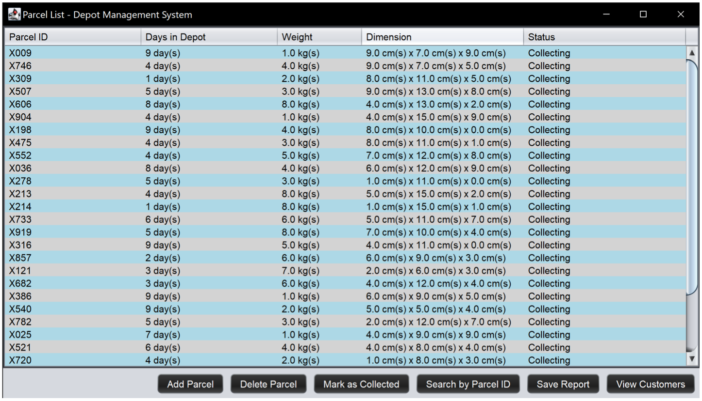
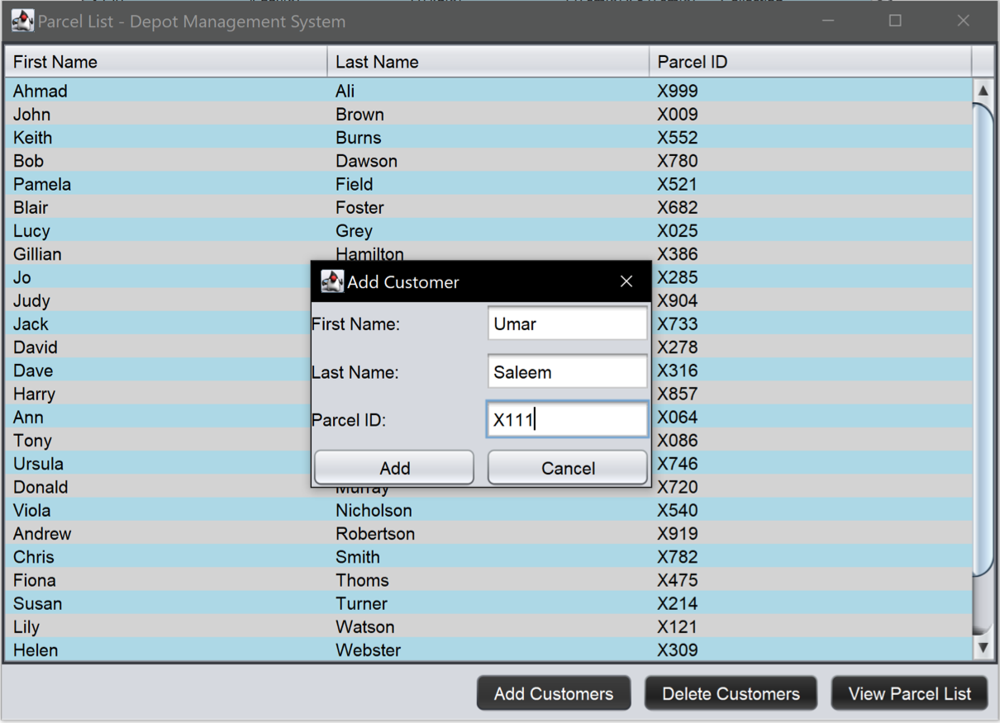
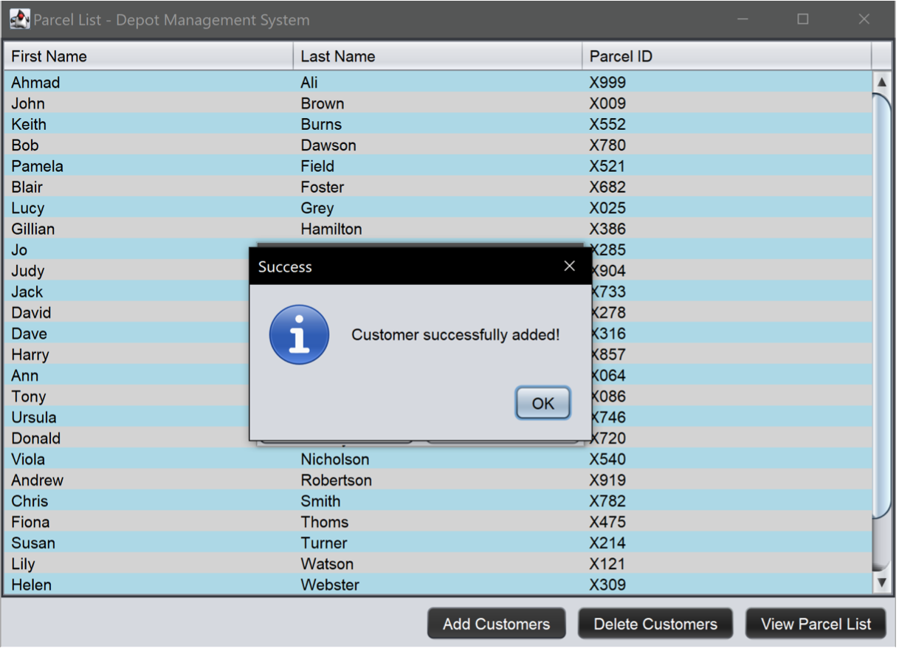
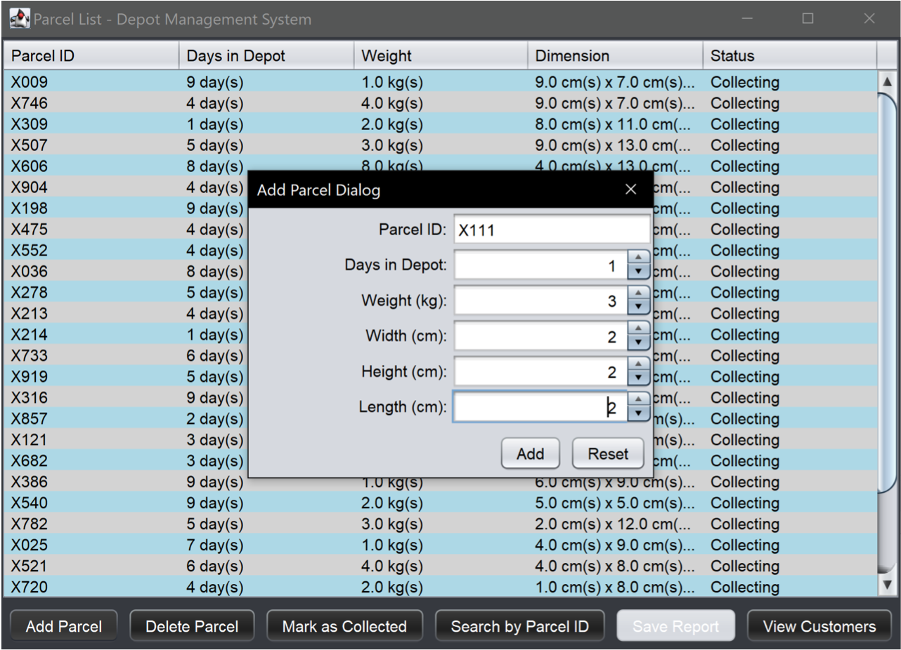
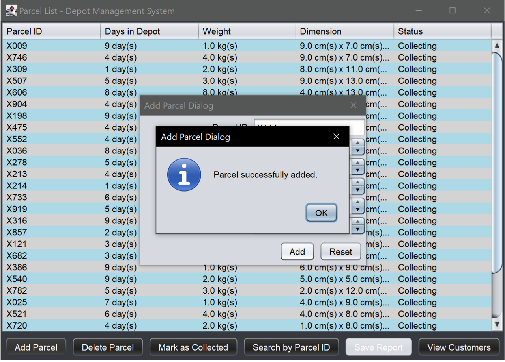
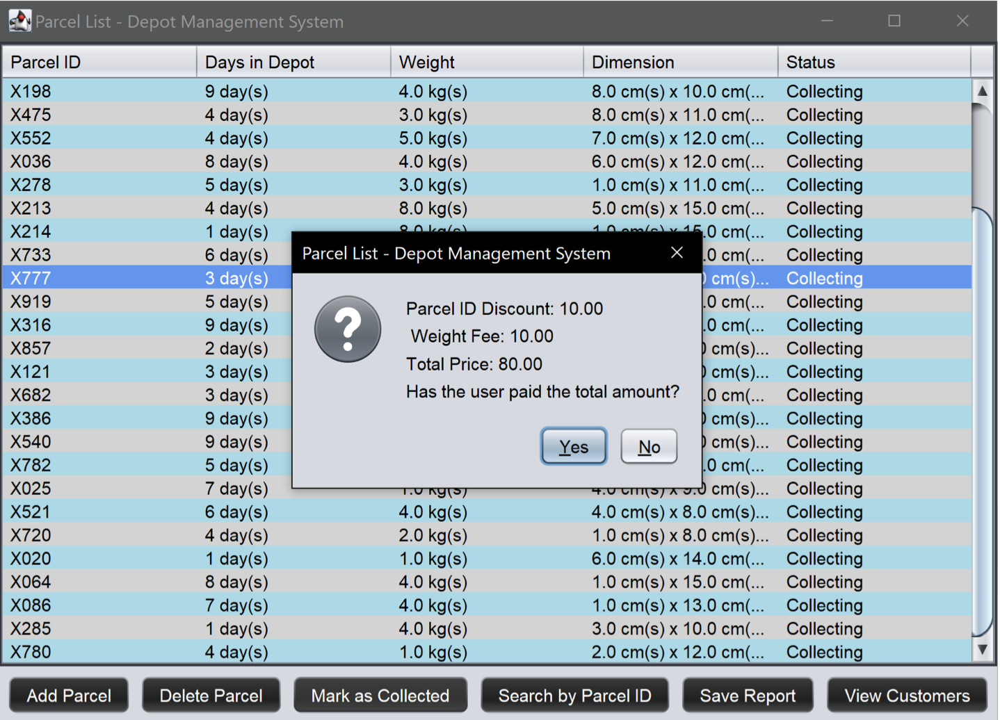
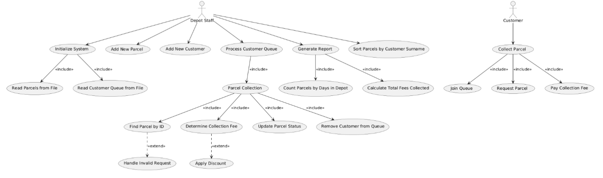
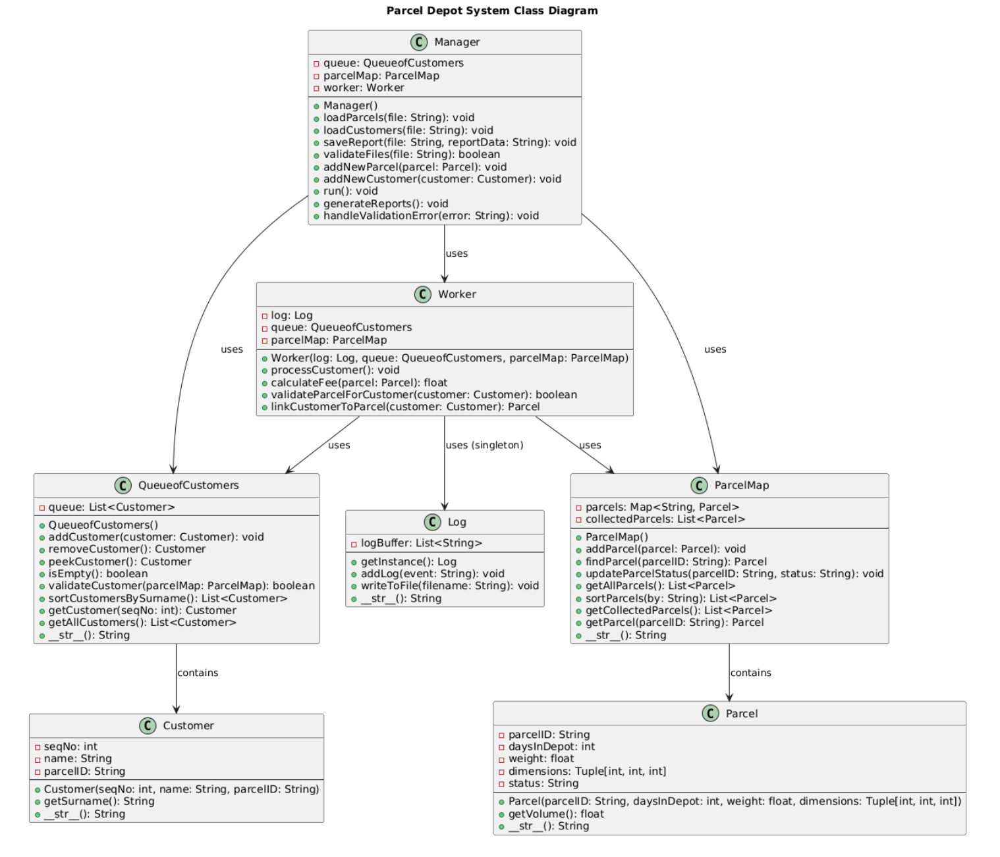
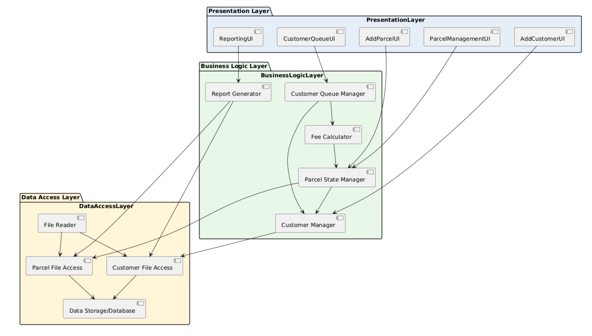

# Parcel Depot Java App

**© 2025 Aashir Javed Mummunka — All Rights Reserved**

This project simulates a depot worker processing customers in a queue and collecting parcels. It demonstrates object-oriented design, data structures, and event logging using Java.

## **Overview**

The application models a parcel-collection workflow where customers wait in a queue, a worker processes each customer, calculates fees, and releases parcels. Parcel data is stored in a map structure, and all system events are recorded in a central log. A GUI (launched by the Manager class) displays the process.

## Application Screenshots

### Main

---

### Add Customer

---

### Customer Add Success

---

### Add Parcel

---

### Parcel Add Success

---

### Parcel Fee Calculation

---

## System Diagrams

### Use Case Diagram

---

### Class Diagram

---

### 3-Tier System Architecture Diagram

---

## **Key Classes**

- **Parcel**  
  Represents parcel objects, including attributes and methods.

- **Customer**  
  Defines customer objects and their associated parcel requests.

- **QueueOfCustomers**  
  Maintains a queue/list of customers awaiting service.

- **ParcelMap**  
  Stores parcel objects using a map data structure.

- **Log**  
  A singleton log class that records system events using a `StringBuffer`.

- **Worker**  
  Processes customers, calculates parcel fees, and releases parcels.

- **Manager**  
  The main controller class. Initializes data structures, reads data files, and launches the GUI.

## **Functionality**

- Load parcel and customer data  
- Maintain an ordered customer queue  
- Process customers sequentially  
- Calculate and display parcel fees  
- Release parcels upon processing  
- Log events centrally  
- Render the workflow through a GUI
